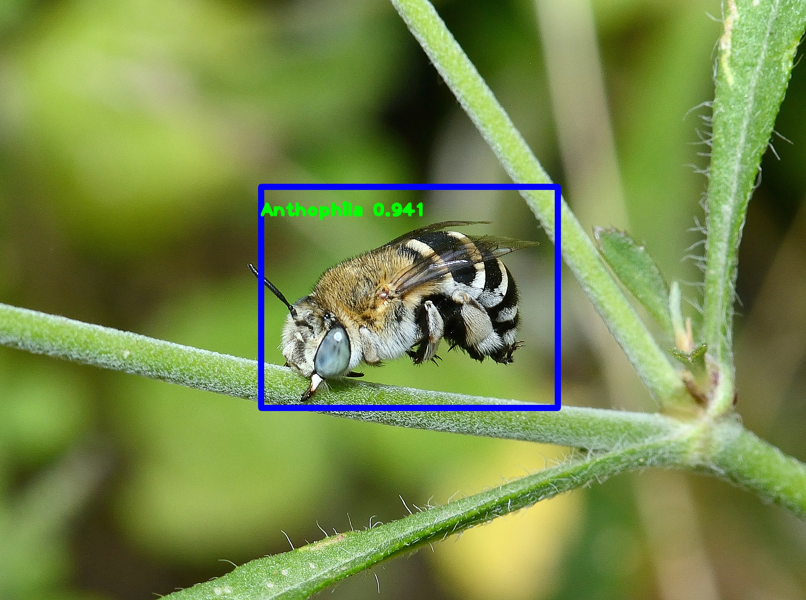

<h1 align="center">Anthophila</h3>


<!-- TABLE OF CONTENTS -->
<details>
  <summary>Table of content</summary>
  <ol>
    <li>
      <a href="#about-the-project">About the project</a>
    </li>
    <li>
      <a href="#getting-started">Getting Started</a>
      <ul>
        <li><a href="#prerequisites">Prerequisites</a></li>
        <li><a href="#installation">Virtual environment</a></li>
        <li><a href="#installation">Folder organization</a></li>
      </ul>
    </li>
    <li><a href="#how-it-works">How it works</a></li>
    <li><a href="#how-to-use-it">How to use it</a></li>
  </ol>
</details>


<!-- ABOUT THE PROJECT -->
## About the project
Anthophila ensures the automatic detection and classification of bees by Deep Learning.
Here we developed an algorithm based on YOLOv2 and ResNet.

The process is divided in 3 phases : 

* Detection of the insect in the picture

<div style="text-align: center;">
  
</div>

* Crop of the picture  

<div style="text-align: center;">
  
</div>

* Classification of the cropped image among * * taxons

<div style="text-align: center;">
  
</div>

<!-- GETTING STARTED -->
# Getting Started
## Prerequisites
Depending on your OS, GPU and Drivers, you will need a custom install to use this algorithm. With at least:
* python3
* numpy
* pandas
* keras
* sklearn
* tensorflow
* bbaug

## Virtual environment
For that, you can use a virtual environment with [python venv](https://docs.python.org/3/library/venv.html)
```
cd project_bees_detection_basile
python3 -m venv venv_bees
source venv_bees/bin/activate
# optionnal: (depending on your hardware) 
# pip install -r requirements.txt

```
## Folder organization
We recommend you to get the data folder and project folder (with the virtual environment) near by.

<div style="text-align: center;">
  
</div>

<!-- HOW IT WORK -->
# How it works
## Code source folder (project_bees_detection/src/yolo) 
In src folder you will find: 

* [scrap_inat](#scrap_inat) (to get initial data)
* [yolo](#yolo) (to make detections)
* [crop](#crop) (to crop detected pictures)
* [classification](#classification) (to classify pictures)

* [train.py](#trainpy) (for training)
* [evaluate.py](#evaluatepy) (for evaluation)
* [predict.py](#predictpy) (for prediction)


## YOLOV2 folder (project_bees_detection/src/yolo/keras_yolov2)
In this YOLO folder you will find: 
* [backend.py](#backendpy) (to create backend of models)
* [frontend.py](#frontendpy) (to create frontend of models)
* [preprocessing.py](#preprocessingpy) (for preprocessing)
* [map_evaluation.py](#mapevaluationpy) (for evaluation)
* [utils.py](#utilspy) (for utilitarian functions)

### backend.py
### frontend.py
### preprocessing.py
### map_evaluation.py
### utils.py

<!-- HOW TO USE IT -->
# How to use it
DETECTION
```
Create a config file, following templates in src/yolo/config

python3 yolo/gen_anchors.py -c path_custom_config.json

Report the output of gen_anchors in the config file

python3 yolo/train.py -c path_custom_config.json
python3 yolo/evaluate.py -c path_custom_config.json
python3 yolo/predict.py -c path_custom_config.json -w path_seleccted_weights.h5 -i path_image_folder_to_predict -o 'csv_input'

This generates a csv with the predictions from the Yolo model, output will be saved in src/datafiles/crop/predict_csv folder

```
CROP
```
In src/crop/cropfromcsv.py complete the following lines : 

  - l8 : path to the folder you have made predictions on
  - l9 : path to the folder you want to store the cropped pictures in
  - l10 : path to the csv output by detection

python3 src/crop/cropfromcsv.py
```


